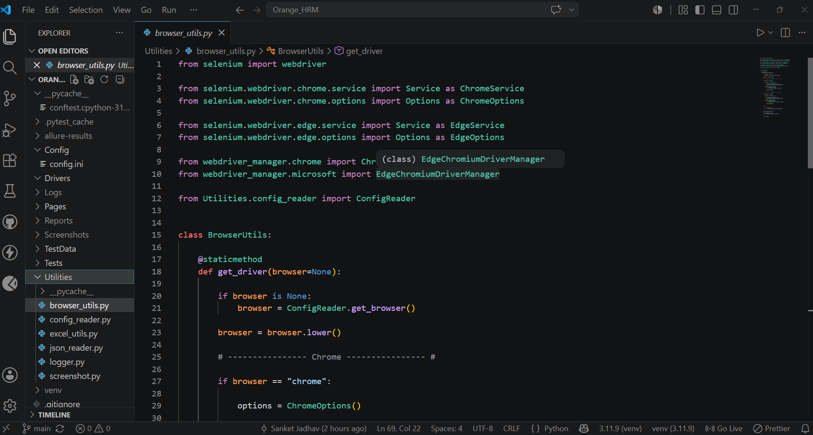
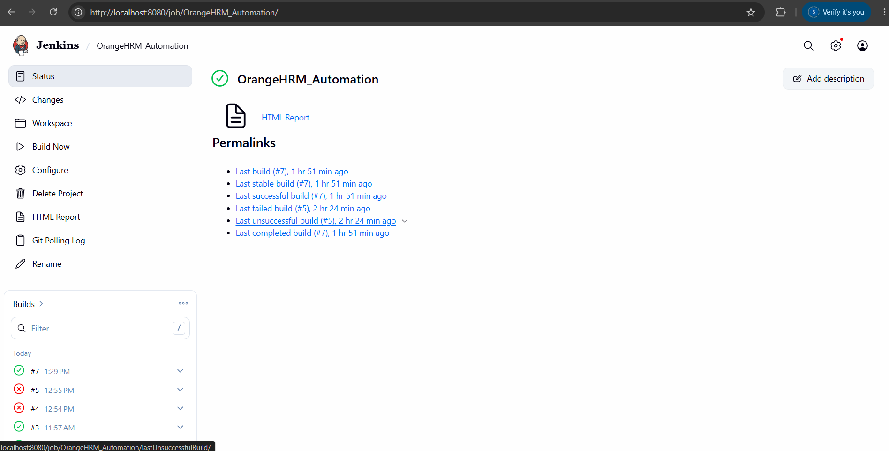
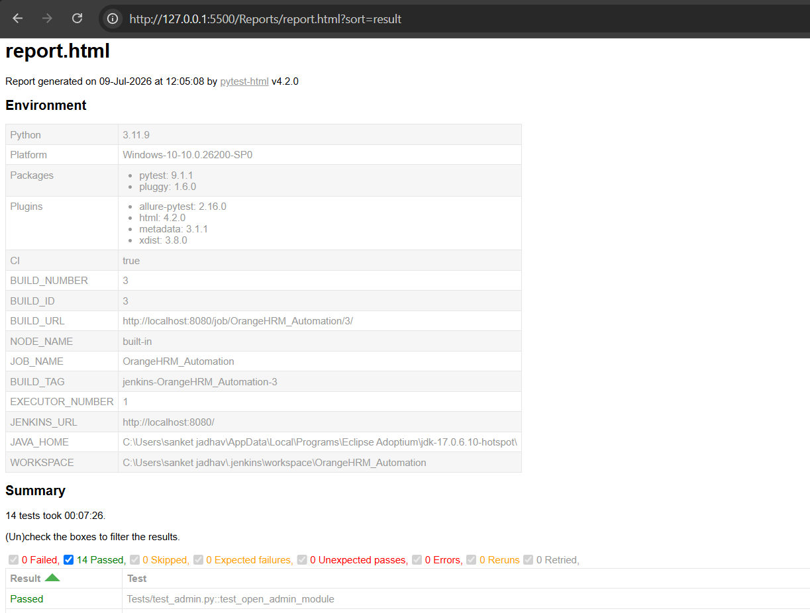
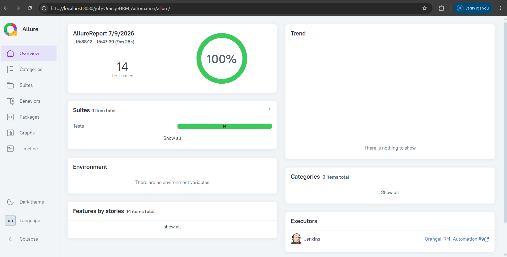

# OrangeHRM Automation Framework


---

## Project Overview

This project is an automation testing framework developed for the OrangeHRM web application using **Python**, **Selenium WebDriver**, and **Pytest**.

The framework follows the **Page Object Model (POM)** design pattern to improve code readability, reusability, and maintainability. It includes Data-Driven Testing using Excel and JSON files, centralized configuration management, reusable page classes, reporting, logging, and Continuous Integration with Jenkins.

The primary goal of this project is to simulate a real-world automation testing framework while applying industry-standard practices.

---

# Framework Architecture

```

                    Test Cases
                         │
                         ▼
                  Page Object Model
                         │
                         ▼
                     Base Page
                         │
      ┌──────────────────┼──────────────────┐
      ▼                  ▼                  ▼
 Config Reader      Excel Reader      JSON Reader
      │                  │                  │
      └──────────────────┼──────────────────┘
                         ▼
                    Selenium Driver
                         ▼
                     OrangeHRM
                         ▼
          HTML Report | Allure Report
                         ▼
                      Jenkins CI

```

---

# Project Features

✔ Page Object Model (POM)

✔ Base Page Implementation

✔ Explicit Waits

✔ Reusable Selenium Methods

✔ Excel Data Driven Testing

✔ JSON Data Driven Testing

✔ Pytest Fixtures

✔ Configuration File Support

✔ Logging

✔ HTML Report

✔ Allure Report

✔ Screenshot Capture

✔ Smoke Testing

✔ Regression Testing

✔ Sanity Testing

✔ Git Version Control

✔ GitHub Repository

✔ Jenkins Integration

---

# Modules Automated

| Module | Status |
|----------|--------|
| Login | ✅ |
| Logout | ✅ |
| Admin | ✅ |
| PIM | ✅ |
| Leave | ✅ |

---

# Technology Stack

| Technology | Purpose |
|------------|----------|
| Python | Programming Language |
| Selenium WebDriver | Browser Automation |
| Pytest | Test Framework |
| OpenPyXL | Excel DDT |
| JSON | Test Data |
| WebDriver Manager | Driver Management |
| Git | Version Control |
| GitHub | Repository |
| Jenkins | Continuous Integration |
| HTML Report | Test Report |
| Allure Report | Advanced Reporting |
| VS Code | IDE |

---

# Project Structure

```

Orange_HRM
│
├── Config
├── Logs
├── Pages
├── Reports
├── Screenshots
├── TestData
├── Tests
├── Utilities
├── conftest.py
├── pytest.ini
├── requirements.txt
└── README.md

```

---

# Prerequisites

- Python 3.11+
- Google Chrome
- Git
- Jenkins
- Java
- Allure

---

# Installation

Clone the repository

```bash
git clone https://github.com/sanket09j/Orange_HRM_Automation.git
```

Navigate to the project

```bash
cd Orange_HRM_Automation
```

Create virtual environment

```bash
python -m venv venv
```

Activate virtual environment

```bash
venv\Scripts\activate
```

Install dependencies

```bash
pip install -r requirements.txt
```

---

# Execute Test Cases

Run all tests

```bash
pytest
```

Smoke Tests

```bash
pytest -m smoke
```

Regression Tests

```bash
pytest -m regression
```

Sanity Tests

```bash
pytest -m sanity
```

Generate HTML Report

```bash
pytest --html=Reports/report.html --self-contained-html
```

Generate Allure Report

```bash
pytest --alluredir=allure-results
allure serve allure-results
```

---

# Reports

The framework generates:

- HTML Report
- Allure Report
- Execution Logs
- Failure Screenshots

---

# Continuous Integration

This framework is integrated with Jenkins.

Jenkins is configured to:

- Pull the latest code from GitHub
- Install required dependencies
- Execute the Pytest suite
- Generate HTML reports

---

# Future Improvements

The following enhancements can be added in the future:

- Parallel execution using pytest-xdist
- Email notifications
- Docker support
- Selenium Grid execution
- GitHub Actions pipeline

---

# Screenshots

OrangeHRM Automation Framework

Project Overview
...

Screenshots

Project Structure


Jenkins Successful Build


HTML Report


Allure Report


---

# Author

**Sanket Jadhav**

Computer Engineering Graduate

Automation Test Engineer (Python • Selenium • Pytest)

GitHub:
https://github.com/sanket09j

